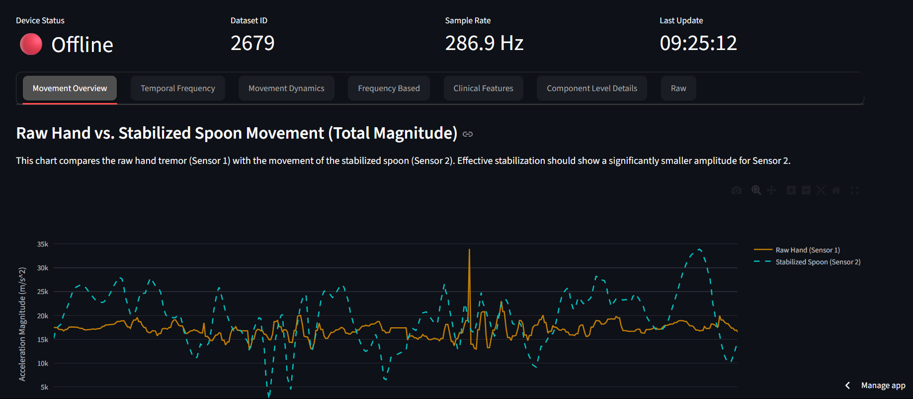

# Comprehensive Parkinson's Movement Analyzer

This project is a real-time, web-based dashboard designed to analyze and visualize hand tremor data for individuals with Parkinson's disease. The application fetches sensor data from a smart glove via a Firebase Realtime Database, performs a suite of advanced signal processing analyses, and presents the results in an intuitive and interactive interface built with Streamlit.

The primary goal is to provide a quantitative, multi-faceted assessment of tremor characteristics, moving beyond simple amplitude measurements to include metrics of smoothness, frequency distribution, and regularity, which are crucial for a clinical understanding of the condition.

## 📸 Dashboard Screenshots

**Important:** You must take screenshots of your running application and place them in a `screenshots` folder in your project directory for them to appear here.

| Composite Index & Main Metrics | Movement Overview Tab |
| :---: | :---: |
|  |  |
| **Temporal Frequency Tab** | **Movement Dynamics Tab** |
|  |  |
| **Frequency Based Tab** | **Clinical Features Tab** |
|  |  |

## ✨ Features

- **Real-Time Data Fetching:** Connects to a Firebase Realtime Database to pull the latest sensor readings automatically.
- **Dual-Sensor Comparison:** Analyzes and compares data from a raw hand sensor (tremor source) and a stabilized spoon sensor (effectiveness of stabilization).
- **Composite Tremor Index:** A weighted, multi-factor score that provides a single, easy-to-understand measure of tremor severity.
- **Advanced Signal Processing:** Utilizes a range of techniques including:
    - Time-Domain Analysis (RMS, Jerk)
    - Frequency-Domain Analysis (FFT, Power Spectrum)
    - Time-Frequency Analysis (Spectrogram)
- **Rich Interactive Visualizations:** Leverages Plotly for dynamic charts, allowing users to zoom, pan, and inspect data points.
- **In-Depth Clinical Biomarkers:** Calculates and displays a suite of metrics used in clinical research, such as Peak Frequency, Spectral Entropy, Crest Factor, and more.
- **Customizable Analysis:** Users can tune the weights of the composite index and the thresholds for severity staging via the sidebar.

## ⚙️ How to Run the Application

Follow these instructions to set up and run the dashboard on your local machine.

### 1. Prerequisites

- Python 3.8 or newer.
- A Firebase Realtime Database with sensor data being uploaded.

### 2. Clone the Repository

```bash
git clone <your-repository-url>
cd <your-repository-folder>
```

### 3. Set Up a Virtual Environment (Recommended)

```bash
# For Windows
python -m venv venv
.\venv\Scripts\activate

# For macOS/Linux
python3 -m venv venv
source venv/bin/activate
```

### 4. Install Dependencies

Install all the required packages using the `requirements.txt` file.

```bash
pip install -r requirements.txt
```

### 5. Configure Firebase Secrets

The application needs credentials to access your Firebase database. Create a file at `.streamlit/secrets.toml` in your project's root directory.

```toml
# .streamlit/secrets.toml

FIREBASE_URL = "https://your-project-name.firebaseio.com"
DB_SECRET = "YourDatabaseSecretKey"
```

- **`FIREBASE_URL`**: The URL of your Firebase Realtime Database.
- **`DB_SECRET`**: Your database secret or an authentication token. You can find this in your Firebase project settings under `Service accounts` > `Database secrets`.

**Note:** The provided Python script has these values hardcoded. For better security, it's highly recommended to modify the script to load them from `st.secrets` as shown below. This prevents your credentials from being exposed in the source code.

```python
# Recommended modification in the Python script
try:
    FIREBASE_URL = st.secrets["FIREBASE_URL"]
    DB_SECRET = st.secrets["DB_SECRET"]
except (AttributeError, FileNotFoundError):
    st.error("Firebase secrets not found. Please create a `.streamlit/secrets.toml` file.")
    st.stop()
```

### 6. Run the Streamlit App

From your terminal, run the following command (replace `app.py` with the name of your Python script file):

```bash
streamlit run app.py
```

The application will open in a new tab in your web browser.

## 🧠 The Algorithm and Analysis Engine

The core of this application is its ability to transform raw accelerometer data into meaningful clinical insights. Here is a breakdown of the analytical pipeline.

### 1. Data Acquisition & Preprocessing

- **Fetching:** The app polls a `/last_dataset_id` endpoint in Firebase to find the latest dataset and then fetches the corresponding data array from `/datasets/{id}`.
- **Time Normalization:** The raw timestamp `t` (in milliseconds) is converted into a relative time `time_s` (in seconds) starting from zero for easier analysis.
- **Magnitude Calculation:** For each sensor, the individual X, Y, and Z acceleration values are combined into a single measure of total acceleration magnitude. This simplifies the primary analysis by representing the overall movement intensity. The formula used is the Euclidean norm:

  ```math
  Magnitude = \sqrt{a_x^2 + a_y^2 + a_z^2}
  ```

### 2. Time-Domain Analysis

This analysis examines the signal's characteristics over time.

- **Root Mean Square (RMS):** Represents the effective power or intensity of the tremor signal. A higher RMS value indicates a more intense tremor.

  ```math
  RMS = \sqrt{\frac{1}{N}\sum_{i=1}^{N} x_i^2}
  ```

- **Jerk:** Jerk is the rate of change of acceleration (the third derivative of position). In this context, it serves as a proxy for the smoothness of the movement. A high RMS of Jerk implies a jerky, non-smooth tremor. It is calculated numerically using the gradient of the acceleration magnitude.

  ```math
  Jerk = \frac{d(Acceleration)}{dt}
  ```

### 3. Frequency-Domain Analysis

This analysis, using the Fast Fourier Transform (FFT), breaks down the tremor signal into its constituent frequencies.

- **Power Spectrum:** The FFT reveals the power or energy present at each frequency. A classic Parkinsonian tremor typically shows a dominant peak in the 3-7 Hz range.

  ```math
  Power(f) = |FFT(signal)|^2
  ```

- **Power in Band Ratio:** This is the ratio of signal power contained within a specific frequency band (e.g., 4-8 Hz) to the total power of the signal. It quantifies how much the tremor conforms to the typical Parkinsonian frequency profile.

- **Spectral Entropy:** Measures the uniformity or randomness of the power spectrum. A low entropy value indicates that the tremor's energy is concentrated at a few specific frequencies (a regular, predictable tremor), while a high entropy value suggests energy is spread out across many frequencies (a chaotic, irregular tremor).

  ```math
  H(P) = -\sum_{f} p(f) \log_2 p(f)
  ```
  where $p(f)$ is the normalized power at frequency $f$.

### 4. Composite Tremor Index

To simplify the multi-faceted analysis into a single score, a **Composite Tremor Index** is calculated. It's a weighted average of normalized key metrics, providing a holistic view of tremor severity.

```math
Index = \frac{w_{rms} \cdot \text{norm}_{rms} + w_{freq} \cdot \text{norm}_{freq} + w_{jerk} \cdot \text{norm}_{jerk}}{w_{rms} + w_{freq} + w_{jerk}}
```


Figure: Weighted Sum 


- $\text{norm}_{rms}$: RMS value, normalized.
- $\text{norm}_{freq}$: Power in the 4-8Hz band, normalized.
- $\text{norm}_{jerk}$: RMS of Jerk, normalized.
- $w_{...}$: User-adjustable weights from the sidebar.

### 5. Clinical Biomarkers

The "Clinical Features" tab provides deeper insights using established biomarkers:

- **Peak Frequency:** The single most dominant frequency in the tremor.
- **Crest Factor:** The ratio of the peak amplitude to the RMS value. It quantifies the "spikiness" of the signal.
- **Zero-Crossing Rate (ZCR):** The rate at which the signal changes sign, providing another estimate of the dominant frequency.
- **Signal Magnitude Area (SMA):** The cumulative sum of the absolute acceleration values, representing the total amount of movement over the recording period.
- **Cross-Axis Correlation:** A heatmap showing how movement along the X, Y, and Z axes are related. High correlation suggests a planar/directional tremor, while low correlation suggests more complex, rotational movement.

## 📊 Dashboard Tabs Explained

### Movement Overview
This tab provides a high-level comparison between the raw hand tremor (Sensor 1) and the movement after mechanical stabilization (Sensor 2). The goal is to see a significant reduction in the amplitude of the "Stabilized" line, demonstrating the effectiveness of the device.

### Temporal Frequency
The **Spectrogram** is a powerful visualization that shows how the frequency content of the tremor changes over time. Time is on the x-axis, frequency on the y-axis, and the color represents the power at that point. A bright, stable horizontal line between 3-7 Hz is a strong indicator of a persistent Parkinsonian tremor.

### Movement Dynamics
- **Poincaré Plot:** This plot graphs each acceleration value against the subsequent value ($a_t$ vs $a_{t+1}$). It reveals the tremor's predictability. A tight, elongated ellipse indicates a highly regular tremor, while a scattered, circular cloud suggests chaotic and unpredictable movement.
- **3D Movement Trajectory:** This plot visualizes the tremor's path in 3D space, helping to identify if the movement is primarily in one direction (linear) or more complex (rotational).

### Frequency Based
This tab shows the **FFT Power Spectrum**. It clearly displays the dominant frequencies in the tremor signal. A large, sharp peak in the red-highlighted "Parkinson's Band" (3-7 Hz) is the key feature to look for.

### Clinical Features
This is the most data-rich tab, designed to offer a clinical-level "fingerprint" of the tremor.
- **Radar Chart:** Provides a multi-dimensional profile, showing the tremor's normalized characteristics (Intensity, Roughness, etc.) at a glance.
- **Core Biomarkers:** A list of key quantitative metrics with explanations.
- **Cross-Axis Correlation & Per-Axis Variability:** These charts reveal the tremor's directional properties.

### Component Level Details & Raw Data
These tabs are for technical users who want to inspect the raw data. They show the time-series data for each individual axis (X, Y, Z) and a table of the raw numerical values.

## 🛠️ Technology Stack

- **Backend/Frontend:** Streamlit
- **Data Analysis:** NumPy, Pandas, SciPy
- **Data Visualization:** Plotly Express, Plotly Graph Objects
- **Data Fetching:** Requests
- **Database:** Google Firebase Realtime Database

